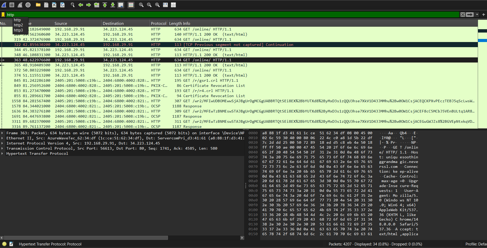

# Java Network Packet Sniffer
A professional network analysis tool built using **Java** and the **Pcap4j** library. 

## 🛡️ Project Overview
This tool hooks into the local network interface to capture live traffic. It was developed to demonstrate the vulnerabilities of unencrypted protocols like **HTTP**.

## 🚀 Features
- Real-time packet interception
- Integration with Wireshark for deep packet inspection (DPI)
- Demonstrates plain-text data exposure on insecure sites (NeverSSL)

## 📸 Proof of Concept

.png

